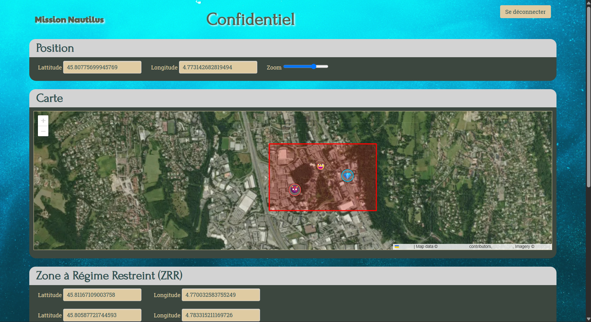
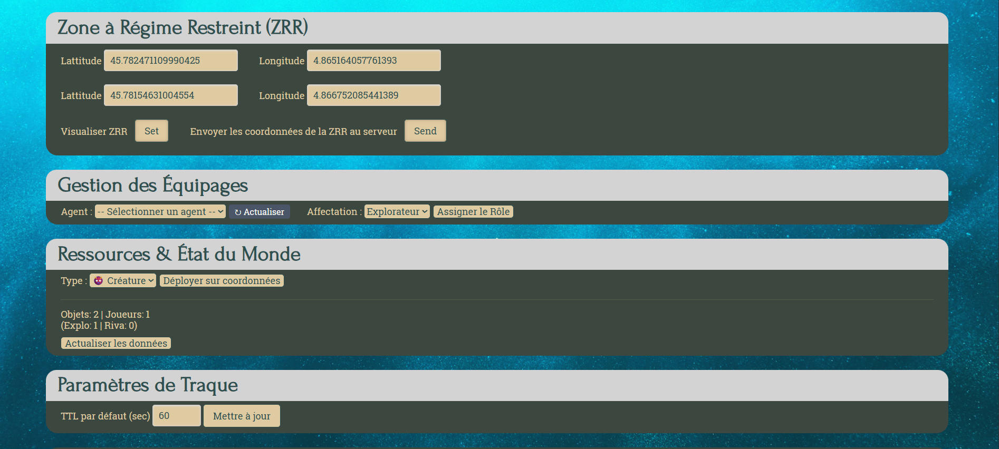
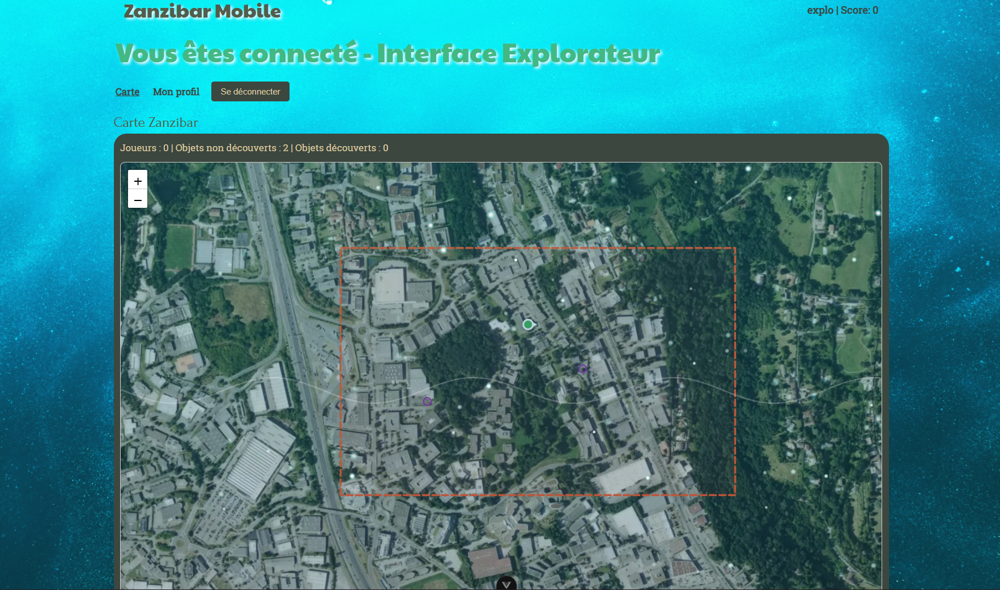
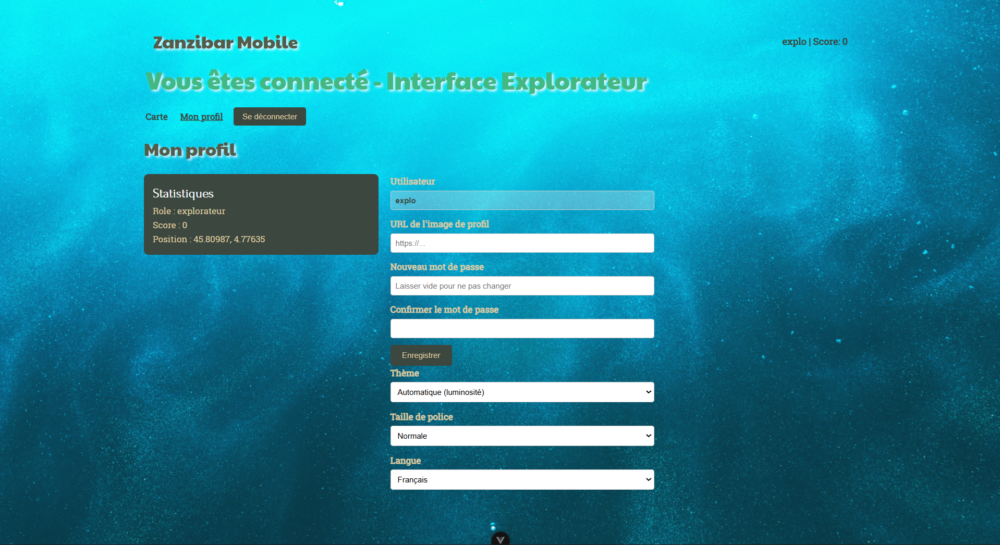
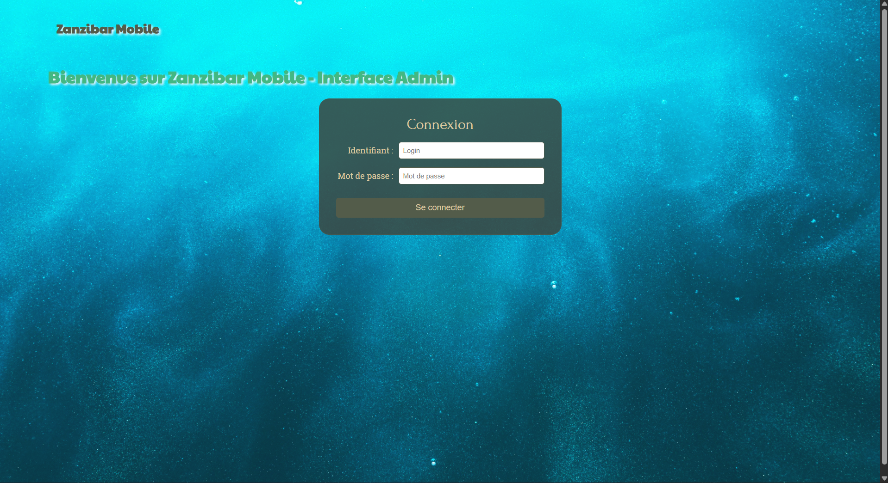
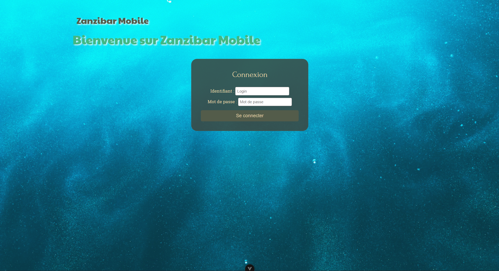

# Mission Nautilus

A web application developed in pairs during the 2nd semester of my first year of a Master's degree in Computer Science.

## About the Project

Mission Nautilus is a real-time geolocation game set in a fictional underwater universe. Players are split into two rival teams — **Explorers** and **Rivals** — competing to locate and secure mysterious artefacts hidden across a defined underwater zone called the **Zanzibar Research Range (ZRR)**.

Inspired by Captain Nemo's legendary *Nautilus*, the game challenges Explorers to protect artefacts from Rivals by reaching them first and securing them, while avoiding dangerous marine creatures scattered across the map. A game master (the *Master of the Abyss*) oversees the whole session, spawning objects in real time and monitoring both teams.

The application consists of three main parts:
- A **REST API** handling game logic, player positions, artefact management, and alerts
- An **admin web client** for the game master to control the session
- A **mobile Progressive Web App** for players in the field, featuring real-time geolocation and dynamic mission updates

## Screenshots

### Admin interface — Game master control panel



### Explorer interface — Player view



### Login pages
| Admin | Explorer |
|-------|----------|
|  |  |

## Tech Stack

| Layer | Technology |
|-------|-----------|
| Frontend | Vue.js |
| Backend | Node.js / Express |
| Auth | JWT (via a provided authentication server) |
| Deployment | VM + Nginx reverse proxy + CI/CD |

## Getting Started

### Prerequisites
- Node.js (v18+)
- npm
- Java (for the authentication server)

### Installation

```bash
# Clone the repository
git clone https://github.com/T0MHtnn/Mission_Nautilus_M1.git
cd Mission_Nautilus_M1

# Install API dependencies
cd API && npm install

# Install admin client dependencies
cd ../admin && npm install

# Install player client dependencies
cd ../client && npm install
```

### Running the app

Open 5 terminals from the project root:

```bash
# 1. Authentication server (Java)
java -jar users.jar --app.origin=http://localhost:5173

# 2. API
cd API && npm start

# 3. Admin client
cd admin && npm run serve

# 4. Rivals client
cd client && npm run dev

# 5. Explorers client
cd clientV2 && npm run dev
```

### Access

| Interface | URL |
|-----------|-----|
| Swagger API docs | http://localhost:8080/swagger-ui/index.html |
| Admin client | http://localhost:8080/secret/login.html |
| Rivals client | http://localhost:5173 |
| Explorers client | http://localhost:5174 |

## Authors

Developed in pairs as part of a Master 1 academic project.
